<div align="center">

# 🌌 Gouranga . Dev — Modern Developer Portfolio

### *A sleek, high-impact personal portfolio built with native HTML5, CSS3, and JavaScript featuring glassmorphism, glowing accents, & cosmic dark-mode aesthetics.*

[](https://developer.mozilla.org/en-US/docs/Web/HTML)
[](https://developer.mozilla.org/en-US/docs/Web/CSS)
[](https://developer.mozilla.org/en-US/docs/Web/JavaScript)
[](../LICENSE)
[](style.css)
[]()

---

</div>

## 🧲 Overview

> **First impressions matter. In a sea of cookie-cutter portfolios, your online presence should leave a lasting impression.**
>
> **Gouranga . Dev** is a personal developer portfolio built entirely with **clean, lightweight native web technologies (HTML5, CSS3, and ES6+ JavaScript)**. It features a cosmic dark gradient design, glassmorphism UI components, dynamic typewriter text animation, smooth scroll spy navigation, responsive mobile hamburger drawer, floating avatar effects, an interactive skills showcase, and an engineering profile dashboard.

---

## 📌 Table of Contents

- [🌌 Gouranga . Dev — Modern Developer Portfolio](#-gouranga--dev--modern-developer-portfolio)
  - [🧲 Overview](#-overview)
  - [📌 Table of Contents](#-table-of-contents)
  - [✨ Features](#-features)
  - [🛠️ Tech Stack](#️-tech-stack)
  - [📂 Project Directory Structure](#-project-directory-structure)
  - [🚀 Quick Start](#-quick-start)
  - [💻 Customization Guide](#-customization-guide)
  - [🛠️ Architecture \& Layout Design](#️-architecture--layout-design)
  - [🤝 Contributing](#-contributing)
  - [📜 License \& Credits](#-license--credits)

---

## ✨ Features

| Feature | Description |
| :--- | :--- |
| **🌌 Cosmic Dark Aesthetic** | Deep multi-stop gradient background (`#030008` ➔ `#0c051a` ➔ `#14082e`) with radial glow overlays for a modern feel. |
| **🔎 Glassmorphism Navbar** | Sticky header with backdrop blur (`backdrop-filter: blur(16px)`), subtle borders, dynamic shadows, and responsive layout. |
| **⌨️ Dynamic Typewriter Effect** | JavaScript-powered typing & deleting animation in the hero section dynamically cycling through developer roles. |
| **📱 Mobile Hamburger Drawer** | Responsive side drawer navigation menu with smooth toggle transition for mobile screens. |
| **📍 Active Scroll Spy** | Dynamic JavaScript scroll observer that highlights the active navbar menu link as you scroll through sections. |
| **🖼️ Floating Avatar** | Circular portrait container with multi-layer CSS box shadows and infinite smooth CSS floating keyframe animation. |
| **⚡ Call to Action Buttons** | Glowing gradient CTA buttons ("Enter Projects", "Let's Talk", "Hire Me") driving user engagement. |
| **👨‍💻 Professional Overview** | Detailed section highlighting engineering background, design principles, and core focus areas. |
| **🚀 Skill Showcase & Expertise Cards** | Clean visual cards breaking down Frontend Engineering, Backend Architecture, UI/UX Systems, and DevOps. |
| **📊 Engineering Profile Card** | Dashboard interface featuring "Open To Work" status badge, personal focus area, and engineering philosophy quote. |
| **💼 Featured Projects Showcase** | Card grid highlighting recent web applications with live preview buttons, code repository links, and technology tags. |
| **📧 Interactive Contact Form** | Form layout complete with input fields, email link, social media links, and JavaScript status confirmation message. |
| **⚡ Zero Dependencies** | Pure native code requiring no build step, node modules, or external frameworks to run. |

---

## 🛠️ Tech Stack

### Project Build Stack
- **HTML5**: Semantic document structure (`<header>`, `<nav>`, `<main>`, `<section>`, `<article>`, `<footer>`, `<form>`).
- **CSS3**: Custom CSS design tokens (`:root` variables), Flexbox, CSS Grid, glassmorphism (`backdrop-filter`), keyframe animations, smooth scrolling, and media queries.
- **JavaScript (ES6+)**: Vanilla client-side script for typewriter role animation, hamburger menu state, scroll spy link activation, and contact form handling.
- **Typography**: Google Fonts ([Inter](https://fonts.google.com/specimen/Inter), [Outfit](https://fonts.google.com/specimen/Outfit), [Merriweather](https://fonts.google.com/specimen/Merriweather)).

*(Note: Skills showcased inside the portfolio UI—such as React, Next.js, Node.js, Express, SQL, etc.—represent engineering competencies, while this website itself is lightweight native HTML/CSS/JS).*

---

## 📂 Project Directory Structure

```text
portfolio/
├── assets/
│   ├── Gemini_Generated_Image_l12uopl12uopl12u.png  # Profile Avatar Image
│   └── color.txt                                    # Palette & design token notes
├── index.html                                       # Main HTML structure & markup
├── style.css                                        # CSS design tokens, layout & animations
├── script.js                                       # Typewriter, navigation & interactive logic
└── README.md                                        # Documentation
```

---

## 🚀 Quick Start

Running this portfolio locally is fast and requires zero setup:

### 1️⃣ Clone the Repository
```bash
git clone https://github.com/your-username/portfolio.git
cd portfolio/portfolio
```

### 2️⃣ Run Locally

#### Option A: Direct Browser Preview
Double-click `index.html` to launch it immediately in any browser.

#### Option B: VS Code Live Server (Recommended)
Open the project in **VS Code**, right-click `index.html`, and select **Open with Live Server**.

#### Option C: Python Local Server
```bash
# Python 3
python -m http.server 8000
```
Then navigate to `http://localhost:8000` in your web browser.

---

## 💻 Customization Guide

Easily adapt this portfolio for your personal brand:

### 1. Personalize Copy & Info (`index.html`)
Update your name, bio, social media profiles, and contact email:
```html
<!-- Branding Logo -->
<a href="#home" class="logo">YourName <span class="-dev">. Dev</span></a>

<!-- Contact Details -->
<a href="mailto:your.email@example.com">your.email@example.com</a>
```

### 2. Customize Typewriter Roles (`script.js`)
Edit the `roles` array to match your technical title:
```javascript
const roles = [
    'Full-Stack Engineer',
    'Frontend Developer',
    'UI/UX Enthusiast',
    'Problem Solver'
];
```

### 3. Replace Profile Picture (`style.css`)
Update the `background-image` path inside `.profile-pic`:
```css
.profile-pic {
    background-image: url("assets/your-photo.png"),
        linear-gradient(135deg, var(--accent-purple), var(--accent-cyan), var(--accent-pink));
}
```

---

### 🎨 Visual Preview

> 📁 **[Portfolio Profile Picture Asset]**
>
> 

---

## 🛠️ Architecture & Layout Design

The page structure follows modern semantic HTML sectioning:

```mermaid
graph TD;
    Body["body: Cosmic Dark Gradient Background"] --> Header["Header: Glassmorphic Sticky Navbar"]
    Header --> Logo["Brand Logo: Gouranga . Dev"]
    Header --> NavLinks["Nav Links: Home, About, Skills, Projects, Contact"]
    Header --> MobileDrawer["Hamburger Menu & Mobile Drawer"]

    Body --> Hero["Hero Section (#home)"]
    Hero --> Bio["Welcome & JS Typewriter Role Text"]
    Hero --> Avatar["Floating Animated Profile Avatar"]

    Body --> About["About Section (#about)"]
    About --> Overview["Overview & Interactive Skill Badges"]
    About --> ProfileCard["Engineering Dashboard: Status & Quote"]

    Body --> Skills["Expertise Section (#skills)"]
    Skills --> SkillCards["Cards: Frontend, Backend, UI/UX, DevOps"]

    Body --> Projects["Featured Projects Section (#projects)"]
    Projects --> ProjectGrid["Project Showcase Cards with Live & Code links"]

    Body --> Contact["Contact Section (#contact)"]
    Contact --> Info["Contact Info & Social Links"]
    Contact --> Form["Interactive JS Contact Form"]

    Body --> Footer["Footer: Copyright & Back To Top link"]
```



---

## 🤝 Contributing

Contributions, issues, and feature requests are welcome!

1. **Fork** the repository
2. **Create** your feature branch (`git checkout -b feature/amazing-feature`)
3. **Commit** your changes (`git commit -m 'Add amazing new feature'`)
4. **Push** to the branch (`git push origin feature/amazing-feature`)
5. **Open** a Pull Request

---

## 📜 License & Credits

Built with ❤️ by **Gouranga**.

- **License**: Released under the [MIT License](LICENSE).
- **Fonts**: [Google Fonts](https://fonts.google.com) (Inter, Outfit, Merriweather)

---

<div align="center">

**[⭐ Star this repository on GitHub](https://github.com/your-username/portfolio) if you like this design!**

</div>
