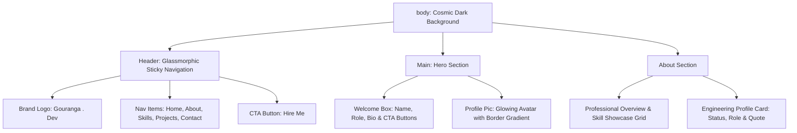

<div align="center">

# 🌌 Gouranga . Dev — Modern Developer Portfolio

### *A sleek, high-impact personal portfolio featuring glassmorphism, glowing accents, & futuristic dark-mode aesthetics.*

[](https://developer.mozilla.org/en-US/docs/Web/HTML)
[](https://developer.mozilla.org/en-US/docs/Web/CSS)
[](https://developer.mozilla.org/en-US/docs/Web/JavaScript)
[](https://react.dev/)
[](https://nodejs.org/)
[](LICENSE)
[](style.css)
[]()

---

</div>

## 🧲 The Hook

> **First impressions matter. In a sea of cookie-cutter portfolios, your online presence should leave a lasting impression.**
>
> **Gouranga . Dev** is a crafted personal developer portfolio designed to showcase modern web design standards—featuring dark cosmic gradients, glassmorphism UI components, glowing neon accents, an interactive skill showcase, and an engineering profile dashboard.

---

## 📌 Table of Contents

- [🌌 Gouranga . Dev — Modern Developer Portfolio](#-gouranga--dev--modern-developer-portfolio)
  - [🧲 The Hook](#-the-hook)
  - [📌 Table of Contents](#-table-of-contents)
  - [✨ Features](#-features)
  - [🛠️ Tech Stack](#️-tech-stack)
  - [📂 Project Directory Structure](#-project-directory-structure)
  - [🚀 Quick Start](#-quick-start)
  - [💻 Customization Guide](#-customization-guide)
  - [🛠️ Architecture \& Layout Design](#️-architecture--layout-design)
  - [🤝 Contributing](#-contributing)
  - [📜 License \& Credits](#-license--credits)

---

## ✨ Features

| Feature | Description |
| :--- | :--- |
| **🌌 Cosmic Dark Aesthetic** | Deep multi-stop gradient background (`#030008` ➔ `#0c051a` ➔ `#14082e`) creating a premium modern feel. |
| **🔎 Glassmorphism Navbar** | Sticky header with background blur (`backdrop-filter: blur(10px)`), dynamic shadows, and glowing accent borders. |
| **🔮 Animated Navigation** | Sleek sliding underline effect on hover (`::after` pseudo-element with neon gradient fills). |
| **🖼️ Glowing Profile Avatar** | Circular portrait container with multi-layer CSS box shadows (`box-shadow: 0 0 25px...`) and scale transformation. |
| **⚡ Call to Action CTAs** | Glowing gradient buttons ("Enter project", "Let's talk", and "Hire Me") designed to drive engagement. |
| **👨‍💻 About & Overview** | Comprehensive section detailing professional overview, engineering principles, and core focus areas. |
| **🚀 Skill Showcase Grid** | Interactive badges highlighting React, Next.js, JavaScript, Node.js, Express, REST APIs, SQL, Git, and UI/UX. |
| **📊 Engineering Profile Card** | Dashboard interface featuring "Open To Work" status badge, dynamic role highlights, and core philosophy quote. |
| **📱 Pure Lightweight Code** | 100% clean, ultra-fast loading HTML5 & CSS3 with custom design tokens. |

---

## 🛠️ Tech Stack

- **Frontend Core**: [HTML5](https://developer.mozilla.org/en-US/docs/Web/HTML) semantic layout (`<header>`, `<nav>`, `<main>`, `<section>`, `<article>`) & [CSS3](https://developer.mozilla.org/en-US/docs/Web/CSS) Flexbox, keyframes, transitions, and glassmorphism filters
- **Engineering Competencies**: React, Next.js, JavaScript (ES6+), Node.js, Express.js, RESTful APIs, SQL Databases, Git, UI/UX Design
- **Typography**: Google Fonts ([Google Sans](https://fonts.google.com/), [Merriweather](https://fonts.google.com/specimen/Merriweather), [Roboto](https://fonts.google.com/specimen/Roboto))

---

## 📂 Project Directory Structure

```text
portfolio/
├── assets/
│   ├── Gemini_Generated_Image_y5kwhzy5kwhzy5kw.png  # Profile Avatar Image
│   ├── file_0000000077b47208862170be7794007b.png     # Graphic Asset
│   └── color.txt                                    # Palette reference notes
├── index.html                                       # Main page template
├── style.css                                        # Core design tokens & styles
└── README.md                                        # Documentation
```

---

## 🚀 Quick Start

Getting this portfolio up and running locally is instantaneous:

### 1️⃣ Clone the Repository
```bash
git clone https://github.com/your-username/portfolio.git
cd portfolio/portfolio
```

### 2️⃣ Run Locally

#### Option A: Direct Browser Preview
Double-click `index.html` to launch it immediately in your browser.

#### Option B: VS Code Live Server (Recommended)
Open the folder in **VS Code**, right-click `index.html`, and select **Open with Live Server**.

#### Option C: Python HTTP Server
```bash
# Python 3
python -m http.server 8000
```
Then navigate to `http://localhost:8000` in your browser.

---

## 💻 Customization Guide

Easily personalize this portfolio for your own brand:

### 1. Update Bio & Copy (`index.html`)

```html
<!-- Customize Name & Branding -->
<a href="#home" class="logo">Gouranga <span class="-dev">. Dev</span></a>

<!-- Hero Section Introduction -->
<p class="name">It's <span class="my-name">Gouranga</span></p>
<p class="role">I'm a Full Stack Developer</p>
<article class="welcome-msg">
  I specialize in building scalable, efficient, and innovative digital solutions.
</article>
```

### 2. Replace Profile Avatar

In `style.css`, update the `.profile-pic` class with your image path:

```css
.profile-pic {
    /* Replace with your image location */
    background-image: url("assets/your-profile-photo.png"),
        linear-gradient(135deg, #82209d, #7a17ba, #3800d1, #2626fd);
}
```

---

### 🎨 Visual Preview

> 📁 **[Portfolio UI Preview]**
>
> ``

---

## 🛠️ Architecture & Layout Design

The architecture follows modern clean layout separation:



---

## 🤝 Contributing

Contributions, issues, and feature requests are welcome!

1. **Fork** the repository
2. **Create** your feature branch (`git checkout -b feature/amazing-feature`)
3. **Commit** your changes (`git commit -m 'Add amazing new feature'`)
4. **Push** to the branch (`git push origin feature/amazing-feature`)
5. **Open** a Pull Request

---

## 📜 License & Credits

Built with ❤️ by **Gouranga**.

- **License**: Released under the [MIT License](LICENSE).
- **Fonts**: [Google Fonts](https://fonts.google.com)

---

<div align="center">

**[⭐ Star this repository on GitHub](https://github.com/your-username/portfolio) if you like this design!**

</div>
